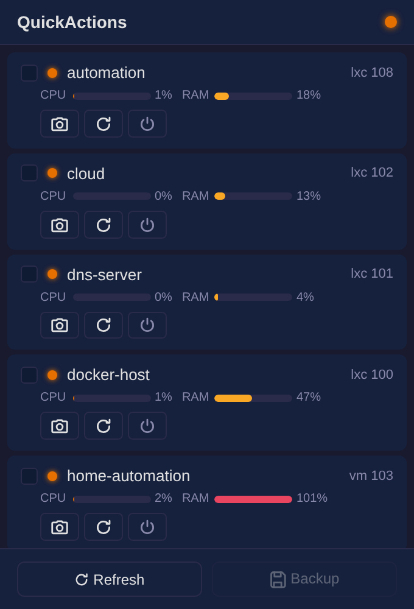
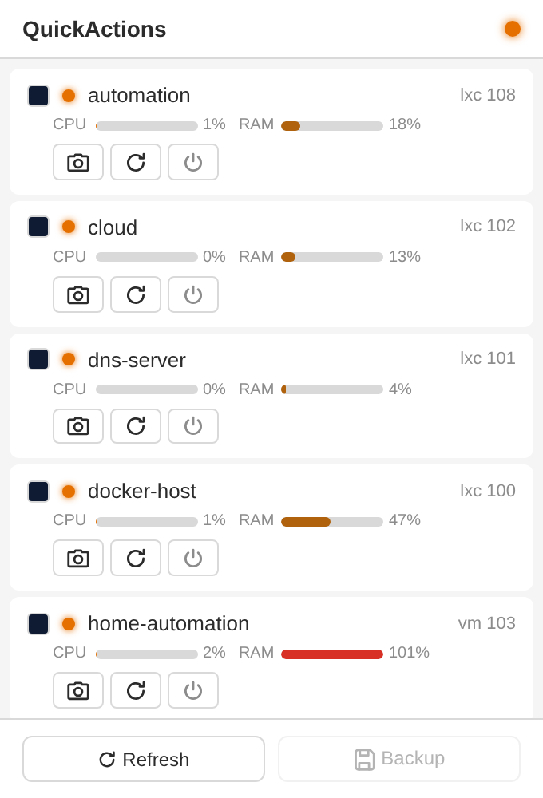
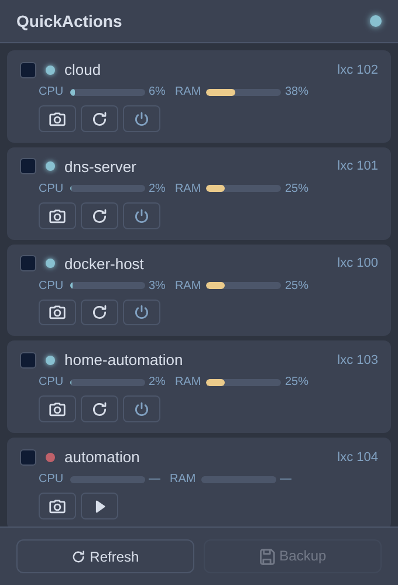
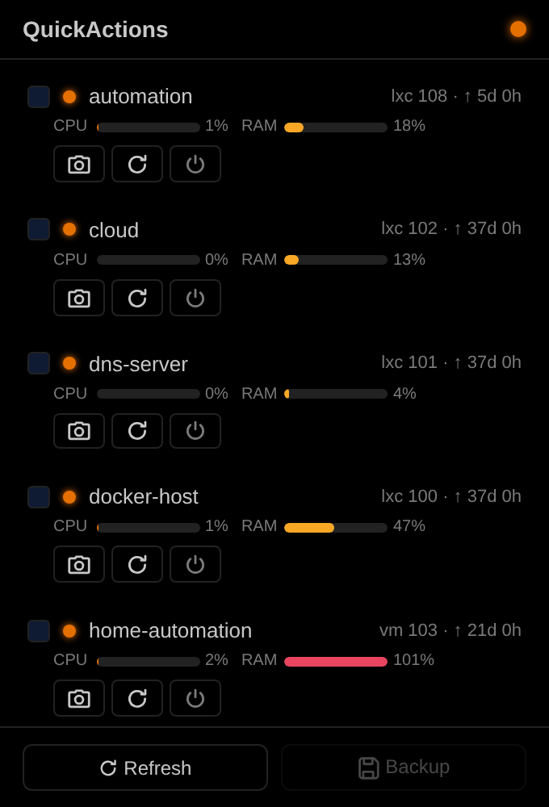
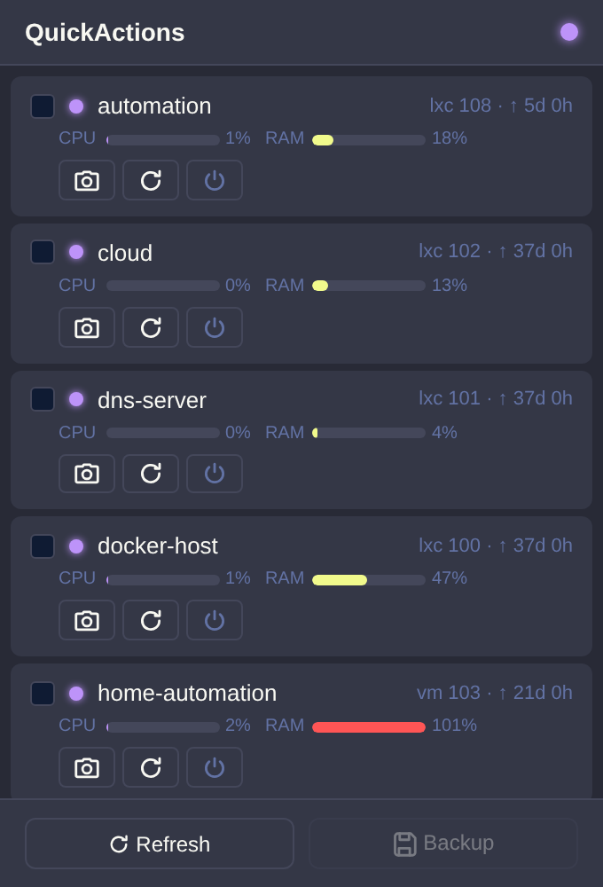
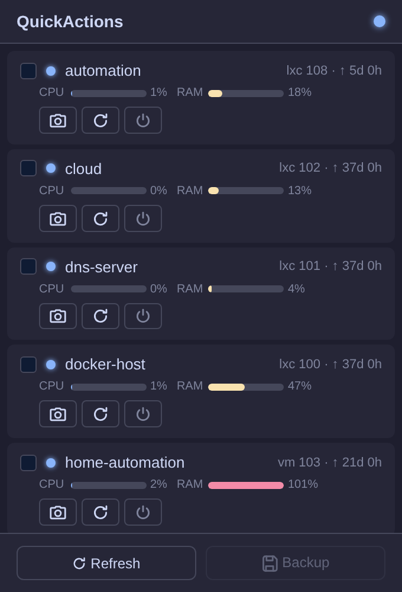
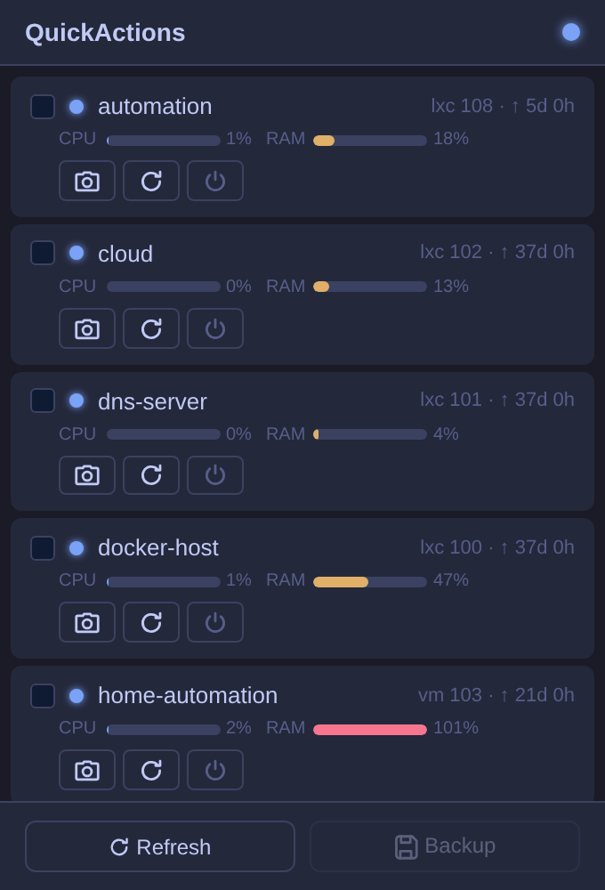
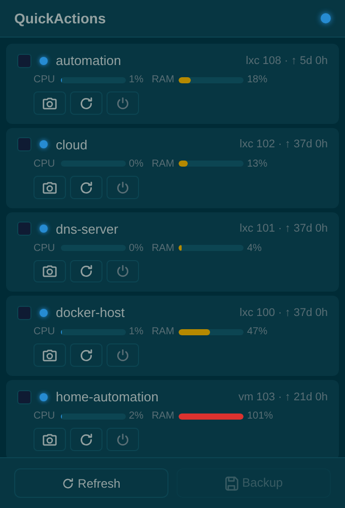
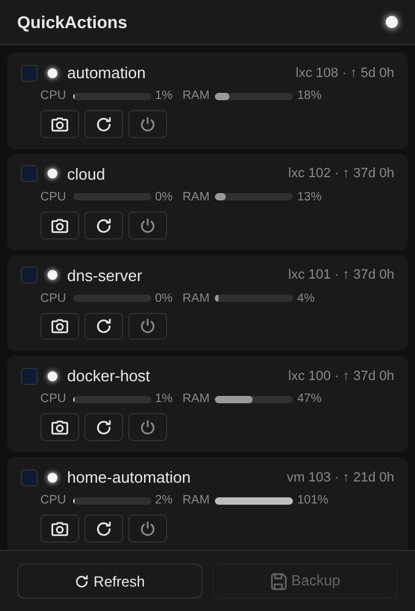

# QuickActions for Proxmox Virtual Environment

A Firefox extension that puts your entire Proxmox VE cluster in your toolbar — see the status of all your VMs and containers at a glance and control them with one click.

> **Note:** This project is not affiliated with, endorsed by, or sponsored by Proxmox Server Solutions GmbH. "Proxmox" and "Proxmox Virtual Environment" are registered trademarks of Proxmox Server Solutions GmbH.

<table width="100%">
  <tr>
    <td align="center" width="33%"><b>Dark</b></td>
    <td align="center" width="33%"><b>Light</b></td>
    <td align="center" width="33%"><b>Nord</b></td>
  </tr>
  <tr>
    <td><a href="screenshots/popup-dark.png" title="Dark Theme — click to enlarge"></a></td>
    <td><a href="screenshots/popup-light.png" title="Light Theme — click to enlarge"></a></td>
    <td><a href="screenshots/popup-nord.png" title="Nord Theme — click to enlarge"></a></td>
  </tr>
  <tr>
    <td align="center" width="33%"><b>OLED</b></td>
    <td align="center" width="33%"><b>Dracula</b></td>
    <td align="center" width="33%"><b>Catppuccin</b></td>
  </tr>
  <tr>
    <td><a href="screenshots/popup-oled.png" title="OLED Theme (True Black) — click to enlarge"></a></td>
    <td><a href="screenshots/popup-dracula.png" title="Dracula Theme — click to enlarge"></a></td>
    <td><a href="screenshots/popup-catppuccin.png" title="Catppuccin Mocha Theme — click to enlarge"></a></td>
  </tr>
  <tr>
    <td align="center" width="33%"><b>Tokyo Night</b></td>
    <td align="center" width="33%"><b>Solarized Dark</b></td>
    <td align="center" width="33%"><b>Monochrome</b></td>
  </tr>
  <tr>
    <td><a href="screenshots/popup-tokyo-night.png" title="Tokyo Night Theme — click to enlarge"></a></td>
    <td><a href="screenshots/popup-solarized-dark.png" title="Solarized Dark Theme — click to enlarge"></a></td>
    <td><a href="screenshots/popup-monochrome.png" title="Monochrome Theme — click to enlarge"></a></td>
  </tr>
</table>

*Click a screenshot to view it full size.*

## Features

- **Live overview** — All guests of your Proxmox cluster with status, uptime, CPU and RAM usage
- **Power actions** — Start, reboot and shutdown directly from the popup (with confirmation dialog)
- **Snapshots** — One click creates a snapshot with automatic naming
- **Backup (vzdump)** — Select guests via checkbox and back them up to your configured storage
- **Cluster support** — Multi-node environments (backups are grouped per node automatically)
- **9 themes** — Dark, Light, Nord, OLED (True Black), Dracula, Catppuccin Mocha, Tokyo Night, Solarized Dark & Monochrome — switchable in the settings
- **Flexible sorting** — Alphabetically, by ID or by status, with running guests first (optional)
- **Auto-refresh** — CPU and RAM values update automatically (configurable 5–60 seconds or disabled)

## Setup

### 1. Create an API token in Proxmox

In your Proxmox web interface:

1. Go to **Datacenter → Permissions → API Tokens**
2. Click **Add**, choose a user and a token name (e.g. `quickactions`)
3. Note the full token ID — it looks like `user@realm!tokenname`
4. Copy the token secret (shown only once)

The token needs permissions for: `VM.Audit`, `VM.PowerMgmt`, `VM.Snapshot`, `VM.Backup` and `Datastore.AllocateSpace` (the built-in `PVEAdmin` role covers all of these).

### 2. Configure the extension

1. Open the extension options (right-click the toolbar icon → *Manage Extension* → *Extension Options*)
2. Enter your Proxmox URL, token ID and token secret
3. Click **Test connection** — Firefox will ask for permission to access your Proxmox server (this happens only once)
4. Select your backup storage from the dropdown

> **Note:** If your Proxmox server uses a self-signed certificate, open the URL once in a regular browser tab and accept the certificate before testing the connection.

## Requirements

- Proxmox VE 7+ (tested with PVE 9.2)
- Firefox 140+
- An API token with the permissions listed above

## Privacy

This extension collects and transmits **no data**. All credentials stay locally in your browser (`browser.storage.local`). Communication happens exclusively between your browser and your Proxmox server — no third parties involved.

# Install

Get it from the [Firefox Add-ons store](https://addons.mozilla.org/firefox/addon/52707fd186ef4ffdb449/) — or grab a signed XPI from the [releases page](https://github.com/AndiAtom/quickactions-for-proxmox/releases).

## Development

```bash
npm install -g web-ext
web-ext lint    # validate
web-ext run     # test in Firefox (hot reload)
web-ext sign    # sign for distribution
```

## Changelog

See [CHANGELOG.md](CHANGELOG.md).

## Disclaimer
This little project was mostly developed by AI. To be specific: zAI GLM 5.3.

## License

[Apache License 2.0](LICENSE)
